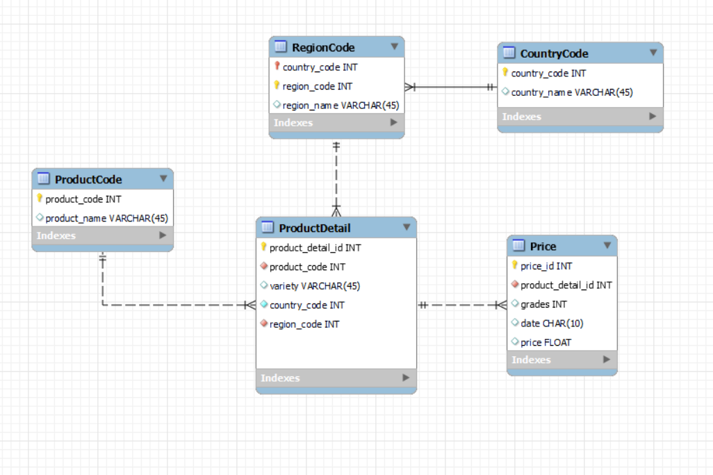

# Dataset Assignment

## How to normalize

* Basic Premise
  * If managed in characters, there are various difficulties such as typos, synonyms, DB capacity, encoding problems, etc. 
    Convert to numbers if possible.
  * Organize separte entities or documentation for data that is highly standardized and unlikely to change in future.

* Processing method for each field
  * **[Product]**
    * It consists of two values, **name** and **code**.
    * Divide and manage as separated values.
    * Extract each value by using regular expression.
  * **[Country]**
    * Numerical management by assigning a number for each country.
  * **[Variety]** 
    * Split based on '/'.
    * Remove redundant values(product name, 'variety') and only the last element is saved.
    * Uncertain degree of standardization of types and names of variety - Just use the original name.
    * 82 out of 752 rows are null - Allow null values.
  * **[Grades]**
    * Split based on '/'.
    * Remove redundant values(product name, 'grade') and only the last element is saved.
    * Standardization is required as the marking method differs by country or region.
      * Convert to number and manage (ex. First Quality -> 1, Second Quality -> 2, High Quality -> 1, null -> 0)
    * Demand for inquiries about the crop itself is expected, so grades are included only in the price entity.
    * 290 out of 752 rows are null - Allow null values.
  * **[Region]**
    * Each raw has a different region notation, so a separate synonym processing process is required.
    * Manage only up to State/Province units.
    * Remove unnecessary special characters (").
  * **[Date(ex.2020-11-16)]**
    * Managed as rows rather than columns as date data is expected to be added later.
    * Since time series data exists for the same crop, a separate entity is formed for price by period.

### Data model

### Result data example
* #### [Table_1] Product Code Table
  product_code | product_name
  :----------: | :----------:
    99         | Avocado
    97         | Apple
    239        | Garlic

* #### [Table_2] Country Code Table
  county_code | country_name
  :----------: | :----------:
    1          | United States
    56         | Chile
    82         | South Korea

* #### [Table_3] Region Code Table
  country_code | region_code | region_name
  :----------: |:-----------:| :---------:
    82         |      2      | Seoul
    82         |     53      | Daegu
    56         |      2      | Santiago

* #### [Table_4] Product Detail Table
  product_detail_id | product_code | variety | country_code | region_code
  :----------------:| :----------: | :-----: |:------------:| :----:
   1  | 99 | Hass |      56      | 2
   2  | 239 | Hanji |      82      | 2
    
  * **(1)** *Avocado (#99),Chile,Avocado / Variety / Hass,Avocado / Grade / Second Quality,"Pedro Aguirre Cerda, Santiago"*
  * **(2)** *Garlic (#239),South Korea,Garlic / Variety / Hanji,Garlic / Grade / High Quality,Seoul*

* #### [Table_5] Price Table
  product_detail_id | grades |   date    | price
  :---------------: |:-----: |:---------:| :---:
    1   | 2 | 2020-11-16 | 4.15
    1   | 2 | 2020-11-09 | 4.34
    2   | 1 | 2020-11-16 | 8.18

  

## Additional value from the dataset
### Changes in prices of agricultural products over time
__*Impossible to find the average since there is no yield or sales data*__
1. Check product code.
2. Get product detail id with corresponding product code from Product Detail entity.
3. Get date and price data by filtering the Price entity based on fetched product detail id. (Period condition can be added)
4. Get maximum, minimum price grouped by date.

 

### Price difference according to the grade of each agricultural product
__*More meaningful analysis will be possible with demand data*__
1. Check product code.
2. Get product detail id with corresponding product code from Product Detail entity.
3. Get grades, date and price data by filtering the Price entity based on fetched product detail id. (Period condition can be added)
4. For each grade:
   1. Get maximum, minimum price grouped by date for each grade. 
   
 

### Differences in price by country for the same variety
__*More meaningful analysis will be possible with import cost data*__
1. Check product code and variety.
2. Check country code of the country you want to know.
3. For each country code:
   1. Get product detail id with corresponding product code and variety from Product Detail entity.
   2. Get maximum, minimum price grouped by date.

 

### Regional price differences within the same country
1. Check country code.
2. Get product detail id and region code with corresponding country code from Product Detail entity.
3. For each region code:
   1. Extract product detail id corresponding to each region code
   2. Get date and price data by filtering the Price entity based on fetched product detail id.
   3. Get maximum, minimum price grouped by date.

  

## Script to put in db
### Basic considerations
* Database
  * It is assumed that RDB is used.
    * Input data format and expected data flow are fixed.
    * Frequent queries are expected.
* Transforming tool
  * Unlike the given csv, the actual occurrence data is expected to be massive. (since the source is worldwide)
  * Distributed processing systems should be used for efficiency
* Notation
  * Since there is a lot of character data, the notation method must be unified.
  * It should be in line with company-wide development standards.
  * Can be easily converted using regular expressions.

### Writing...

### Other considerations 
* Synonym processing
  * If a match is not found, exception processing.
  * Record the error value so that it can be checked later.